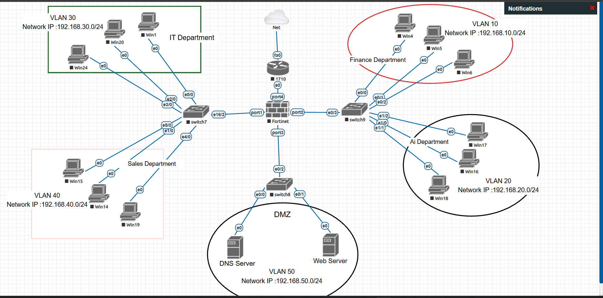

# Enterprise Network Security Project

## Overview

This project presents a secure enterprise network architecture designed using FortiGate Next-Generation Firewall (NGFW), VLAN segmentation, security policies, NAT, routing, and a dedicated DMZ.

The network is designed for a multi-department organization consisting of Finance, AI, IT, and Sales departments. Each department is isolated into a separate VLAN and IP subnet to improve network segmentation and access control.

A dedicated DMZ is also included to host public-facing services such as a Web Server and DNS Server.

The FortiGate firewall acts as the central security control point between the internal networks, DMZ, and the external Internet.

---

## Network Topology




The topology consists of:

- FortiGate Firewall
- Internal Departmental Networks
- VLAN-based Network Segmentation
- DMZ Network
- Web Server
- DNS Server
- WAN / Internet Connection

---

## Network Segmentation

| VLAN | Department | Network |
|------|------------|---------|
| VLAN 10 | Finance | 192.168.10.0/24 |
| VLAN 20 | AI | 192.168.20.0/24 |
| VLAN 30 | IT | 192.168.30.0/24 |
| VLAN 40 | Sales | 192.168.40.0/24 |
| VLAN 50 | DMZ | 192.168.50.0/24 |

Each VLAN uses a dedicated subnet and default gateway to provide logical separation between network segments.

---

## Security Architecture

The network is divided into three primary security zones:

### 1. WAN Zone

The WAN represents the external Internet and is considered an untrusted network.

Inbound traffic from the Internet is restricted and only required public services are allowed to reach the DMZ.

### 2. Internal Zone

The Internal Zone contains:

- Finance
- AI
- IT
- Sales

Communication between internal VLANs is restricted according to security requirements and business needs.

### 3. DMZ Zone

The DMZ is isolated from the internal networks and contains:

- Web Server
- DNS Server

The DMZ allows controlled access to services that may require external connectivity while protecting internal departmental networks.

---

## Security Controls

The project applies several network security principles:

- Network Segmentation
- Least Privilege
- Default Deny
- Inter-VLAN Access Control
- DMZ Isolation
- Firewall Traffic Filtering
- Source NAT
- Destination NAT
- Controlled Internet Access

---

## Firewall Security Policy

Traffic is controlled based on:

- Source
- Destination
- Service
- Action
- Business requirement

### Outbound Internet Access

The following networks are allowed controlled Internet access:

| Source | Destination | Services | Action |
|--------|-------------|----------|--------|
| Finance VLAN | Internet | HTTP/HTTPS/DNS | ALLOW |
| AI VLAN | Internet | HTTP/HTTPS/DNS | ALLOW |
| IT VLAN | Internet | HTTP/HTTPS/DNS | ALLOW |
| Sales VLAN | Internet | HTTP/HTTPS/DNS | ALLOW |
| DMZ | Internet | Required Services | ALLOW |

Source NAT is applied to private addresses when traffic leaves the network toward the Internet.

---

## Inter-VLAN Access Control

Inter-department communication is restricted to reduce unnecessary lateral movement.

Examples:

| Source | Destination | Action |
|--------|-------------|--------|
| Finance | AI | DENY |
| Finance | IT | DENY |
| Finance | Sales | DENY |
| AI | Finance | DENY |
| AI | IT | DENY |
| Sales | Finance | DENY |
| Sales | AI | DENY |
| IT | Internal Networks | LIMITED |

Authorized administrative access can be permitted when required.

---

## DMZ Security

The DMZ is protected from direct unrestricted access to internal networks.

### Internet → DMZ

Public access is limited to required services.

Example:

```text
Internet → Web Server → HTTP/HTTPS → ALLOW
